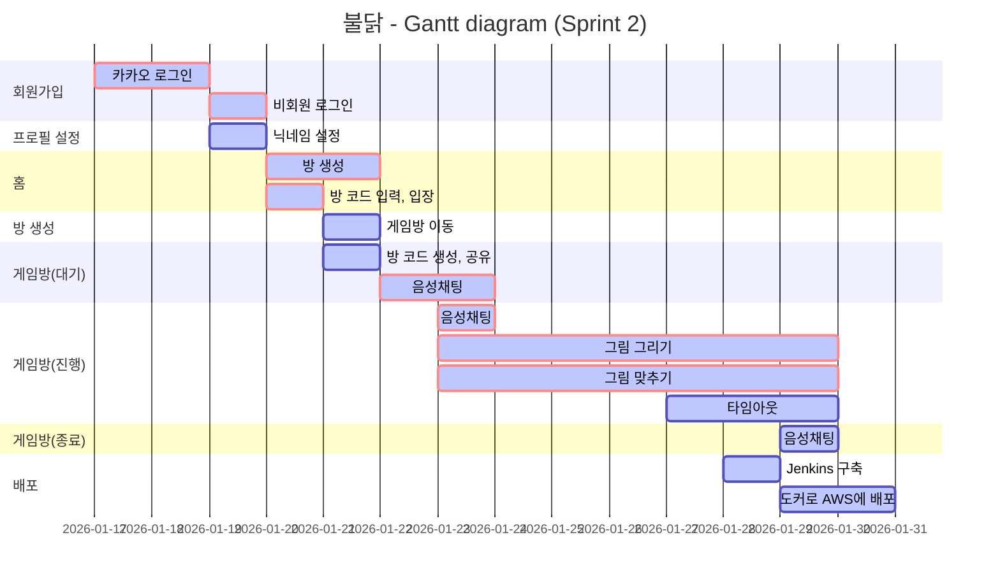
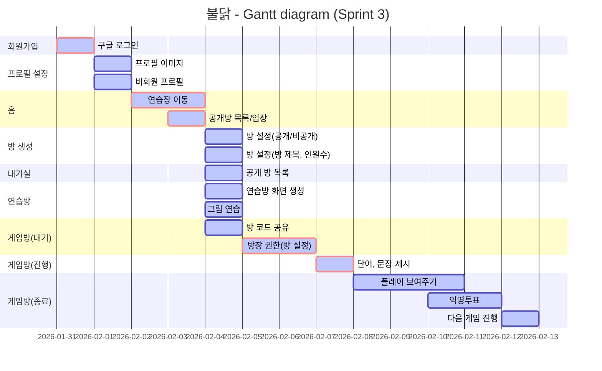
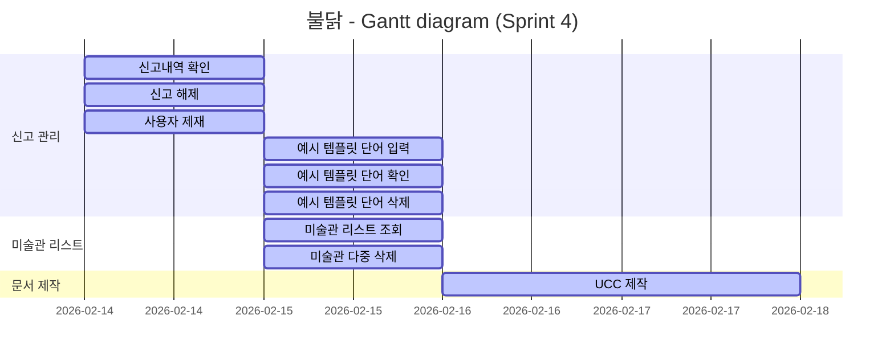

# 간트 차트

스프린트 #2

```mermaid
gantt
title 불닭 - Gantt diagram (Sprint 2)
dateFormat  MM-DD

section 회원가입
카카오 로그인 :active, crit, 01-17, 2d
비회원 로그인 :active, crit, 01-19, 1d

section 프로필 설정
닉네임 설정 :active, 01-19, 1d

section 홈
방 생성 :active, crit, 01-20, 2d
방 코드 입력, 입장 :active, crit, 01-20, 1d

section 방 생성
게임방 이동 : active, 01-21, 1d

section 게임방(대기)
방 코드 생성, 공유 : active, 01-21, 1d
음성채팅 : active, crit, 01-22, 2d

section 게임방(진행)
음성채팅 : active, crit, 01-23, 1d
그림 그리기 : active, crit, 01-23, 7d
그림 맞추기 : active, crit, 01-23, 7d
타임아웃 : active, 01-27, 3d

section 게임방(종료)
음성채팅 : active, 01-29, 1d

section 배포
Jenkins 구축 : active, 01-28, 1d
도커로 AWS에 배포 : active, 01-29, 2d
```

스프린트 #3

```mermaid
gantt
title 불닭 - Gantt diagram (Sprint 3)
dateFormat  MM-DD

section 회원가입
구글 로그인 :active, crit, 01-31, 1d

section 프로필 설정
프로필 이미지 :active, 02-01, 1d
비회원 프로필 :active, 02-01, 1d

section 홈
연습장 이동 :active, crit, 02-02, 2d
공개방 목록/입장 :active, crit, 02-03, 1d

section 방 생성
방 설정(공개/비공개) : active, 02-04, 1d
방 설정(방 제목, 인원수) : active, 02-04, 1d

section 대기실
공개 방 목록 : active, 02-04, 1d

section 연습방
연습방 화면 생성 : active, 02-04, 1d
그림 연습 : active, 02-04, 1d

section 게임방(대기)
방 코드 공유 : active, 02-04, 1d
방장 권한(방 설정) : active, crit, 02-05, 2d

section 게임방(진행)
단어, 문장 제시 : active, crit, 02-07, 1d

section 게임방(종료)
플레이 보여주기 : active, 02-08, 3d
익명투표 : active, 02-10, 2d
다음 게임 진행 : active, 02-12, 1d
```

스프린트 #4

```mermaid
gantt
title 불닭 - Gantt diagram (Sprint 4)
dateFormat  MM-DD

section 신고 관리
신고내역 확인 :active, 02-14, 1d
신고 해제 :active, 02-14, 1d
사용자 제재 :active, 02-14, 1d
예시 템플릿 단어 입력 :active, 02-15, 1d 
예시 템플릿 단어 확인 :active, 02-15, 1d
예시 템플릿 단어 삭제 :active, 02-15, 1d

section 미술관 리스트
미술관 리스트 조회 :active, 02-15, 1d
미술관 다중 삭제  :active, 02-15, 1d

section 문서 제작
UCC 제작 :active, 02-16, 2d
```

